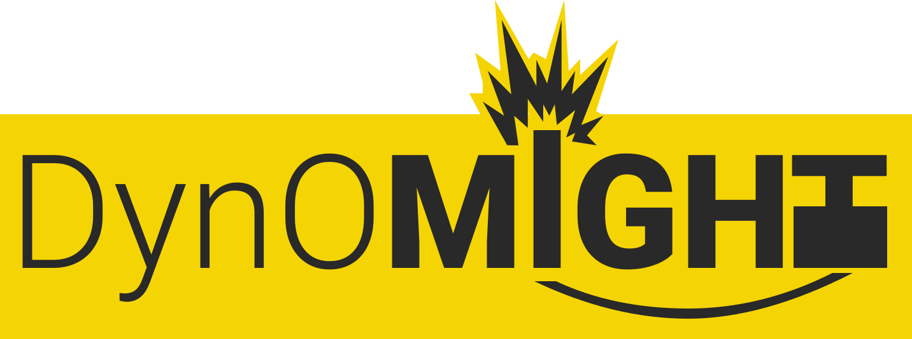

Contributing to Lambda Controller
=================================

**Before you continue** Please make sure you have read our [Code Of Conduct](code_of_conduct.md)

-   [Issues](#issues)
-   [Pull Requests](#pull-requests)
-   [Setup development environmment](#setup-development-environment)

Issues
------

-   State version of node/Lambda Controller/enviromemnt/os.
-   enviroment means are running it locally or in AWS
-   Include a minimal script which can reproduce the issue.

Pull Requests
-------------

1.  Fork this repo
2.  Create a new Issue, or pick one to work on and comment that you are working on it. 
3.  Create a new branch
4.  Make your changes
5.  Add Tests for your changes
6.  Document your changes
7.  Run the entire test suite
8.  Make sure your changes work on node 12.x 
9.  Open a pull request and mention the issue that you are addressing. 

Setup development environment
-----------------------------

1.  Clone the repo, and change in to the cloned folder
2.  Run `nom i` to install dependancies

`npm run lint` to lint the project.

`npm test` to run the test suite currently set up using [mocha](https://mochajs.org) and [chai](https://www.chaijs.com) and coverage with [istanbul](https://istanbul.js.org) but plan to move to [jest](https://jestjs.io)
